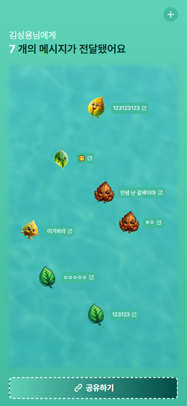

# 나뭇잎 롤링페이퍼

<!--Project Title Image-->

<!--Table of Contents-->

# Table of Contents

- [[1] 프로젝트 소개](#1-프로젝트-소개)
  - [기술스텍](#기술스텍)

# [1] 프로젝트 소개

나뭇잎 롤링페이퍼로 마음을 전해보세요

- 친구의 생일때 롤링페이퍼 이야기를 나누며 아이디어를 얻었어요
- 공유받은 카카오톡 URL로 친구의 페이지에 들어갈 수 있어요

## 기술스텍

- [Next.js](https://nextjs.org/) 14.1.3
- [React](https://reactjs.org/) 18
- [Prisma](https://www.prisma.io/) 5.12.1
- [Redux](https://redux.js.org/) 4.2.1
- [Redux Toolkit](https://redux-toolkit.js.org/) 1.9.7
- [React Query](https://tanstack.com/query/v4) 5.28.9
- [Next Auth](https://next-auth.js.org/) 4.24.7
- [PostgreSQL](https://www.postgresql.org/) (implied by @vercel/postgres)
- [TypeScript](https://www.typescriptlang.org/) 5
